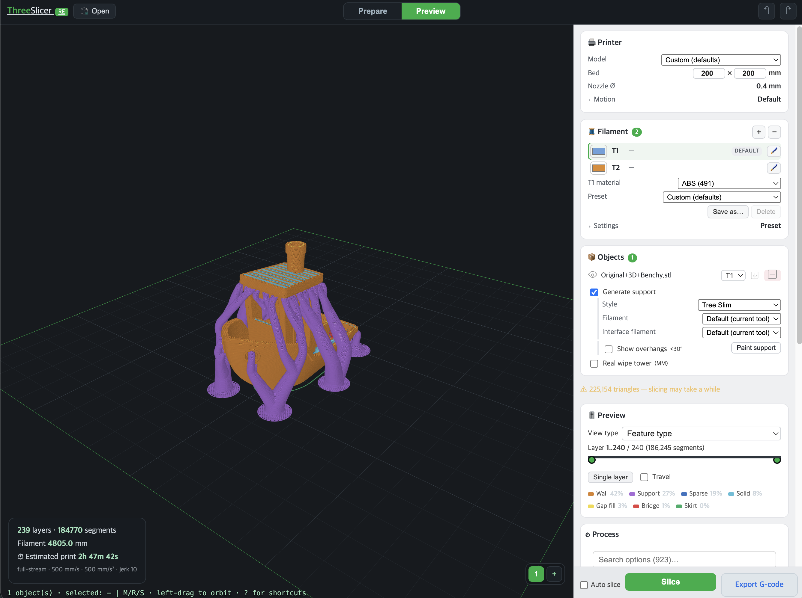

# Web Three Slicer

A 3D-printing slicer that runs entirely in the browser — reverse-engineered from [OrcaSlicer](https://github.com/OrcaSlicer/OrcaSlicer) into a WASM kernel + npm packages. STL/OBJ/3MF/AMF/PLY in (STEP via a pluggable loader), G-code out; no server, no install. A slicer-written `.3mf` project restores its plate layout, settings and support/material painting, and multi-material printing works through per-extruder filament presets and facet painting with a real ported prime tower.



## Links

- Demo: [slicer.kimgh06.com](https://slicer.kimgh06.com/)
- npm package: [three-slicer](https://www.npmjs.com/package/three-slicer)
- Source: [kimgh06/Web_Three_Slicer](https://github.com/kimgh06/Web_Three_Slicer)

## Package (`packages/`, npm workspace)

| Package | What it is |
|---|---|
| `three-slicer` | WASM slicing kernel SDK — batch/streaming slice, worker protocol, settings mapping. Headless-capable (Node or browser), **no three.js dependency** |
| `three-slicer/data` | Extracted OrcaSlicer metadata: config schema, UI tree, toggle rules, invalidation map |
| `three-slicer/components` | React `<SettingsPanel/>` — schema-driven settings form, props-only, Shadow DOM isolated |
| `three-slicer/viewer` | React `<Viewport/>` — three.js scene, model import, worker slicing, GPU volumetric toolpath preview, Shadow DOM isolated |

Quick taste:

```jsx
import { useState } from 'react'
import Viewport from 'three-slicer/viewer'
import SettingsPanel from 'three-slicer/components'

function App() {
  const [settings, setSettings] = useState({})       // OrcaSlicer schema keys, sparse
  return (<>
    <Viewport settings={settings} setSettings={setSettings} />
    <SettingsPanel settings={settings} setSettings={setSettings} />
  </>)
}
```

Headless (no UI): `const s = await createSlicer(); s.slice(stl, params)` — see [`packages/README.md`](packages/README.md).

## Repository layout

- **`packages/`** — published npm package `three-slicer`, extracted data, React components/viewer, and WASM kernel sources. Self-contained: builds, tests, and runs without `slicers/`.
- **`web/`** — demo viewer app that consumes `three-slicer` through the workspace package name.
- **`slicers/`** — untracked reference clones (each its own git remote): upstream OrcaSlicer at `slicers/slicer` (the extraction/porting source) and PrusaSlicer at `slicers/PrusaSlicer` (comparison only).

```bash
# demo viewer (committed WASM — no emscripten needed)
cd web/viewer && npm i && npm run dev

# kernel test suite (120+ invariants)
node packages/wasm-core/test.mjs

# tarball independence gate (packs three-slicer, builds Vite+Next consumers outside the repo)
bash packages/pack_check.sh
```

Development docs (stage-by-stage log, reverse-engineering guide, format specs): [`web/README.md`](web/README.md), [`web/GUIDE.md`](web/GUIDE.md), [`web/SPECS.md`](web/SPECS.md).

## License

AGPL-3.0-or-later (see [`LICENSE.txt`](LICENSE.txt)) — derived from OrcaSlicer. Note that AGPL extends to network use: a web service embedding these packages must offer its source to its users.
