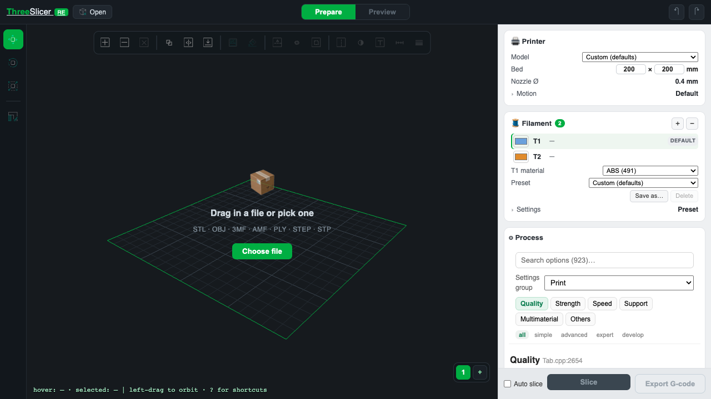

# three-slicer/viewer

3D slicer viewer as a React component: three.js viewport (orbit/transform gizmos), model import (STL/OBJ/3MF/AMF/PLY + pluggable formats such as STEP, multi-object, drag & drop), Web Worker slicing via `three-slicer`, support and material painting, per-extruder filament presets, multi-plate, and a GPU-instanced volumetric toolpath preview ported from OrcaSlicer's libvgcode (millions of segments in a single draw path, per-feature colors, layer range slider, G-code export).



```bash
npm i three-slicer     # react, react-dom and three are peer dependencies — npm installs them for you
```

```jsx
import { useState } from 'react'
import Viewport from 'three-slicer/viewer'

function App() {
  const [settings, setSettings] = useState({})   // OrcaSlicer schema keys; sparse — defaults fill the rest
  return <Viewport settings={settings} setSettings={setSettings} />
}
```

Styles are injected into the component's Shadow DOM root — nothing to import, and host CSS cannot collide.

Slice parameters are derived from `settings` via `three-slicer`'s schema mapping — pair it with `three-slicer/components`' `<SettingsPanel/>` sharing the same state for a full slicer UI.

A `.3mf` written by a slicer (OrcaSlicer/BambuStudio save, MakerWorld download) imports as a **project**: plate layout, project settings, and support/material painting are restored, not just the meshes. Where a facet carries both paint kinds, material paint wins and the dropped support paint is reported.

Props: `settings`, `setSettings`, and three optional React-node slots rendered in the right sidebar —
`processPanel` (the process card), `motionPanel` (folded into the printer card) and `filamentPanel`
(folded into the filament card, next to the material picker).

Subpath exports for custom UIs (framework-free, no React):
- `three-slicer/viewer/toolpath` — GPU toolpath renderer (`buildSegmentData`, `makeToolpath`, view-type colorers)
- `three-slicer/viewer/loaders` — model loaders returning unified triangle soup
- `three-slicer/viewer/gcode` — `parseGcode(text)`, G-code back into the layer stream the renderer consumes

## Embedding it without the panels

Every panel can be switched off, and the values the component owns can be seeded and watched, so the same
`<Viewport/>` also works as a bare G-code viewer or as a headless slicer inside another app's UI.

```jsx
// A G-code viewer: no kernel run, no panels.
<Viewport gcode={text} panels={{ sidebar: false, topBar: false, gizmoRail: false, plateBar: false }} />

// A headless slicer: the host drives it and takes the result.
<Viewport panels={{ sidebar: false }} defaultAutoSlice onSliced={({ stats, gcode }) => save(gcode)} />
```

- **`panels`** — `{name: false}` hides one. Everything is visible by default, so a host only ever opts out and a
  panel added in a later version does not vanish for hosts that listed the ones they wanted. `sidebar: false` drops
  the whole right column; the rest are `topBar`, `gizmoRail`, `objectToolbar`, `paintPanel`, `statsCard`, `plateBar`,
  `emptyHint`, `status`, `printerCard`, `filamentCard`, `objectList`, `previewControls`, `processCard`, `sliceBar`.
- **`gcode`** — G-code text drawn on the selected plate instead of a slice result. `parseGcode` recovers roles from
  `;TYPE:` (OrcaSlicer/PrusaSlicer/Cura), from `;_EXTRUSION_ROLE:` tags and from this kernel's own feature comments;
  bead width comes from `;WIDTH:` or, absent that, from E. What the file never states cannot be recovered: an
  unmarked run reads as wall, and there is no print-time estimate (that needs the machine's acceleration limits).
- **`defaultExtruderColors`**, **`defaultAutoSlice`** — initial values for state the component owns. Unlike the
  in-app toggle, `defaultAutoSlice` also performs the *first* slice, which is what makes a panel-less embed able to
  slice at all.
- **`onEvent`** — one channel for every change: `canvasMode`, `objects`, `selectedPlate`, `plateCount`,
  `extruderColors`, `autoSlice`, `slicing`, `progress`, `viewType`, `paintMode`, `layerCount`, `layerRange`,
  `error`, `notice`. Initial values are not announced — the host passed them. `progress` fires several times a
  second while slicing.
- **`onSliced`** — `{plate, stats, gcode}` when a slice is cached. Switching plate tabs does not re-fire it.

## Materials and painting

The filament card holds **one material per extruder**: add an extruder, pick its colour, and pick its filament preset from the vendor catalog (`filamentPresets()` in `three-slicer/settings` — the shortlist is the printer model's own recommendation, the full list everything compatible). Selecting a row aims the material picker and the settings form at that extruder; the colours feed the object meshes, the prime tower and the preview's **Filament** view type, which colours every segment by the extruder that printed it.

The brush has two targets sharing one shell: **support painting** (enforcer / blocker) and **material painting** (one chip per extruder, plus an eraser that returns facets to the default extruder). They are mutually exclusive, and that is a data constraint rather than a UI choice — upstream's `EnforcerBlockerType` is a single enum in which ENFORCER *is* Extruder1 and BLOCKER *is* Extruder2, so one integer per facet means a support mark and a material mark cannot coexist there.

Two limits to expect while using it:

- Painting a region onto a second extruder only takes effect with **support turned off**. The painted multi-material path emits no support, so a support-enabled slice deliberately stays on the single-material path (where painted support keeps working as before).
- On a machine with two or more extruders, a support *blocker* paint and an *Extruder 2* paint are the same mark and cannot be told apart.

If you consume `three-slicer/viewer/toolpath` directly, note that the stride-8 role field `paths[k+3]` now carries the printing extruder alongside the role as `role + tool * 16`. Mask it — `& 15` for the role, `>>> 4` for the tool. Streams produced before this encoding are entirely below 16 and decode to their own role with tool 0, so older data still reads correctly.

## Multithreaded slicing (automatic)

The engine ships two WASM kernels: single-threaded (default) and `-pthread` multithreaded (~2× wall-clock on layer-parallel wall generation, measured 12× on the wall pass itself). The worker picks the mt kernel automatically when the page is [cross-origin isolated](https://developer.mozilla.org/en-US/docs/Web/API/Window/crossOriginIsolated) — i.e. served with:

```
Cross-Origin-Opener-Policy: same-origin
Cross-Origin-Embedder-Policy: require-corp
```

No headers → falls back to the single-threaded kernel. Nothing else to change.

## Bundler notes

- **Vite:** two config lines (worker code-splitting + top-level await in the mt glue; Chrome 89+/Safari 15+):

```js
// vite.config.js
export default defineConfig({
  worker: { format: 'es' },
  build: { target: 'es2022' },
})
```

- **Next.js / webpack:** render client-side (`dynamic(..., { ssr: false })`) and alias the emscripten glue's Node-only guards away:

```js
// next.config.js
module.exports = {
  webpack: (config) => {
    for (const m of ['node:module', 'node:fs', 'node:path', 'node:url', 'node:crypto', 'node:worker_threads'])
      config.resolve.alias[m] = false
    return config
  },
}
```

`three` is a peer dependency pinned to `^0.160` (TransformControls API; r169+ changed its Object3D contract).

## License

AGPL-3.0-or-later (derived from OrcaSlicer). A web app embedding this package must comply with AGPL — including offering its source to network users.
